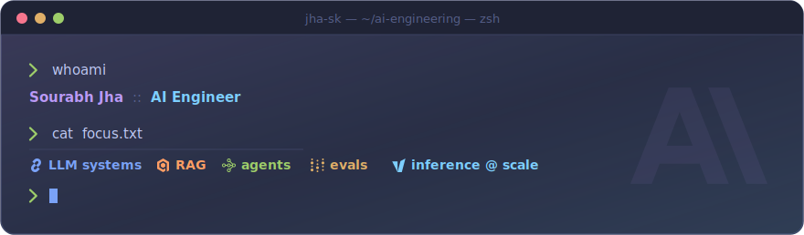
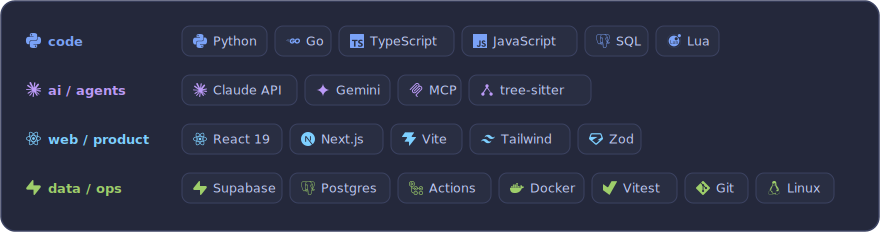
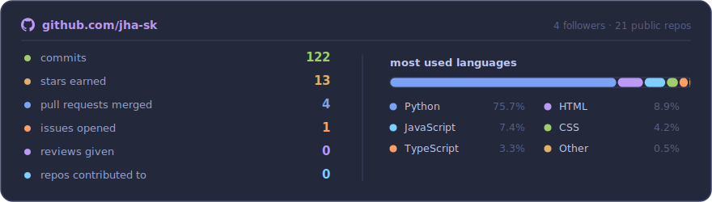

<!--
  ─────────────────────────────────────────────────────────────────────────────
  Theme: Tokyo Night — Storm (dark) / Day (light). Both modes are hand-rendered
  SVGs in ./assets, swapped via <picture> + prefers-color-scheme.

  TO PERSONALISE, edit:
    · the links in the chips row below (LinkedIn / X / Hugging Face / email)
    · "Currently" and "Selected work" — replace with your real repos
    · the stack: edit GROUPS in assets/generate.py, then `python assets/generate.py`

  The stats card currently holds PLACEHOLDER numbers. It fills with real data the
  first time .github/workflows/profile-assets.yml runs (daily, or run it manually
  from the Actions tab).
  ─────────────────────────────────────────────────────────────────────────────
-->

<div align="center">

<picture>
  <source media="(prefers-color-scheme: dark)" srcset="assets/banner-dark.svg">
  <source media="(prefers-color-scheme: light)" srcset="assets/banner-light.svg">
  
</picture>

<p>
  <a href="https://github.com/jha-sk">
    <picture>
      <source media="(prefers-color-scheme: dark)" srcset="assets/social-github-dark.svg">
      <source media="(prefers-color-scheme: light)" srcset="assets/social-github-light.svg">
      
    </picture>
  </a>
  <a href="https://www.linkedin.com/in/sk-jha/">
    <picture>
      <source media="(prefers-color-scheme: dark)" srcset="assets/social-linkedin-dark.svg">
      <source media="(prefers-color-scheme: light)" srcset="assets/social-linkedin-light.svg">
      
    </picture>
  </a>
  <a href="https://x.com/cannibiscoder">
    <picture>
      <source media="(prefers-color-scheme: dark)" srcset="assets/social-x-dark.svg">
      <source media="(prefers-color-scheme: light)" srcset="assets/social-x-light.svg">
      
    </picture>
  </a>
  <a href="mailto:sourabhjha.personal@gmail.com">
    <picture>
      <source media="(prefers-color-scheme: dark)" srcset="assets/social-email-dark.svg">
      <source media="(prefers-color-scheme: light)" srcset="assets/social-email-light.svg">
      
    </picture>
  </a>
</p>

</div>

---

I build **LLM systems that survive contact with production** — retrieval that stays
grounded, agents that fail loudly instead of silently, and inference that stays cheap
under load. Most of my work lives at the seam between a model and the system around it:
evals, guardrails, latency budgets, and cost per request.

- 🧠 **Now** — agentic retrieval pipelines: multi-hop RAG, tool-calling graphs, structured outputs
- 🔬 **Thinking about** — eval-driven development for LLM apps; offline scores that actually predict online behaviour
- ⚙️ **Optimising** — token cost and p95 latency at inference time (batching, caching, quantisation, smaller routers)
- 🤝 **Open to** — collaborating on open-source AI tooling, evals, and inference infrastructure

<br>

## Stack

<div align="center">

<picture>
  <source media="(prefers-color-scheme: dark)" srcset="assets/stack-dark.svg">
  <source media="(prefers-color-scheme: light)" srcset="assets/stack-light.svg">
  
</picture>

</div>

<br>

## Selected work

<!-- Replace these with your real repositories — pin the same ones on your profile. -->

| Project | What it does | Stack |
| :--- | :--- | :--- |
| **[project-one](https://github.com/jha-sk)** | Multi-hop RAG service with citation-grounded answers and a regression eval suite | `Python` · `FastAPI` · `pgvector` |
| **[project-two](https://github.com/jha-sk)** | Agent runtime with typed tools, retries, and per-step tracing | `Python` · `LangGraph` · `Claude API` |
| **[project-three](https://github.com/jha-sk)** | Self-hosted inference gateway — routing, batching, token accounting | `Go` · `vLLM` · `Kubernetes` |

<br>

## How I work

```yaml
principles:
  - evals before prompts        # you cannot improve what you cannot measure
  - retrieval beats fine-tuning # until it provably doesn't
  - small models, sharp scope   # route the easy 80% away from the expensive model
  - observability by default    # traces, token counts, and cost on every request
  - ship thin, measure, widen
```

<br>

## Stats

<div align="center">

<picture>
  <source media="(prefers-color-scheme: dark)" srcset="assets/stats-dark.svg">
  <source media="(prefers-color-scheme: light)" srcset="assets/stats-light.svg">
  
</picture>

<br><br>

<picture>
  <source media="(prefers-color-scheme: dark)" srcset="https://github-readme-activity-graph.vercel.app/graph?username=jha-sk&radius=14&hide_border=false&custom_title=Contribution%20activity&bg_color=24283b&color=c0caf5&title_color=bb9af7&line=7aa2f7&point=bb9af7&area_color=7aa2f7&area=true">
  <source media="(prefers-color-scheme: light)" srcset="https://github-readme-activity-graph.vercel.app/graph?username=jha-sk&radius=14&hide_border=false&custom_title=Contribution%20activity&bg_color=e1e2e7&color=3760bf&title_color=9854f1&line=2e7de9&point=9854f1&area_color=2e7de9&area=true">
  
</picture>

</div>

<br>

<div align="center">
<sub>Tokyo Night · Storm &amp; Day — cards rendered from <a href="assets/">./assets</a>, refreshed daily by
<a href=".github/workflows/profile-assets.yml">GitHub Actions</a>.</sub>
</div>
